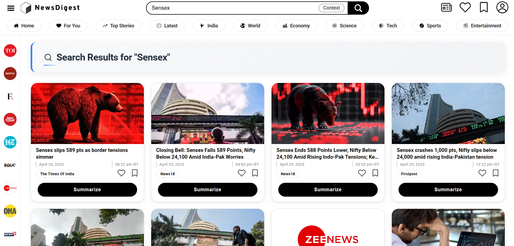
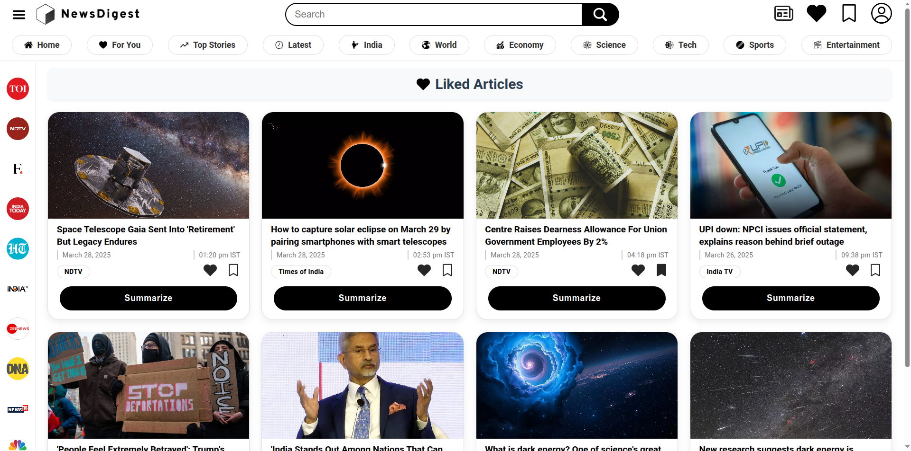

# NewsDigest: AI-Powered News Aggregator and Summarizer

## Description
**NewsDigest** is an intelligent news aggregator that collects articles from multiple sources, eliminates duplicates using semantic similarity, summarizes content using AI, and personalizes user feeds based on preferences and interactions. Built with FastAPI and React, it provides a seamless and informative news consumption experience.

## Features
- 📰 Aggregates news from multiple RSS feeds
- 🤖 AI-generated summaries using DistilBART
- 🧠 Deduplication using SBERT embeddings + cosine similarity
- 🔍 Contextual and keyword-based search
- ❤️ User interactions: likes, bookmarks, history
- 📌 Personalized feed based on user history and subscriptions
- 🔐 JWT-based user authentication

## Project Snapshots

<strong>Generating Summaries</strong>

## Tech Stack
- **Frontend:** ReactJS
- **Backend:** FastAPI, SQLAlchemy
- **Database:** PostgreSQL + pgvector (To store embeddings)
- **AI Models:** DistilBART (To generate summaries), SBERT (To generate contextual embeddings)
- **Libraries:** Pytorch, Transformers (HuggingFace), Feedparser (To parse RSS Feeds), Newspaper3K (To extract Article Text)
- **Other Tools:** Docker (For Database), Git etc. 

 