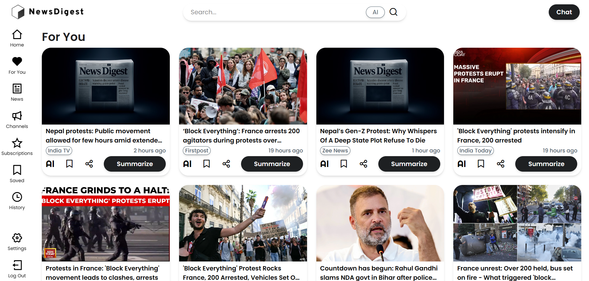
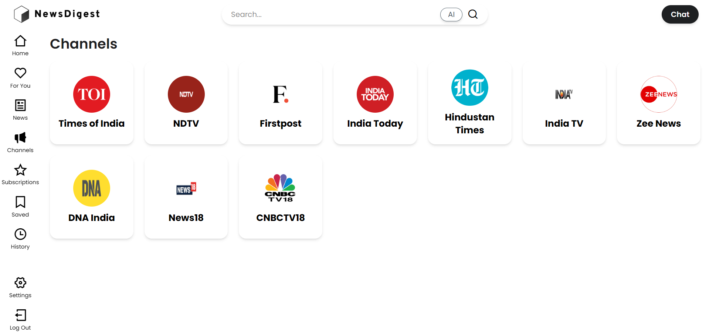
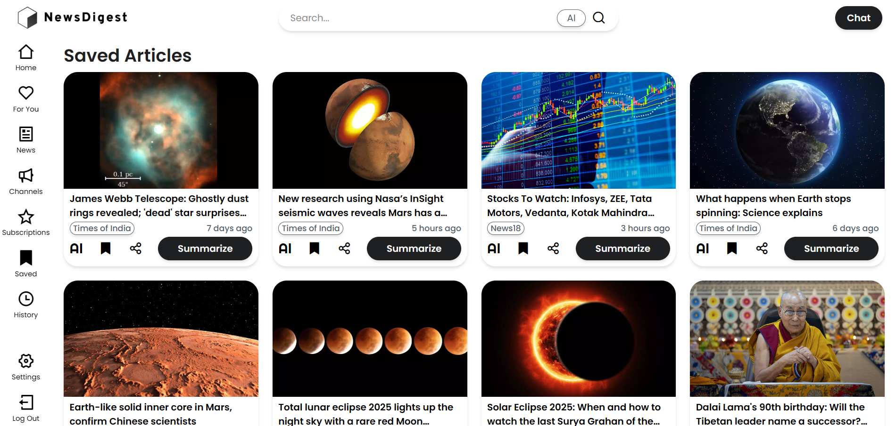
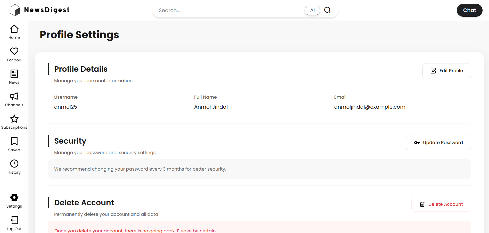

# NewsDigest

NewsDigest is an AI-powered news aggregator designed to fix the modern news experience. It cleans up your feed by removing duplicates, uses AI to summarize articles for you, and helps you find exactly what you're looking for with a smart, context-aware search.

<p align="center">
  
  
  
  
  
</p>

---

<p align="center">
  
</p>

## The Problem

Most news feeds are a mess. You're flooded with articles from countless sources, see the same story repeated with slightly different headlines, and spend more time scrolling than reading. I built NewsDigest to solve this. The goal was to create a single place to read the news that respects your time and learns what you're interested in.

## Features

* **Aggregate Multiple Sources**: Pulls in articles from any RSS feed you want. All your news, one feed.
* **No More Duplicates**: Instead of just looking at headlines, NewsDigest uses SBERT embeddings to understand the *semantic meaning* of articles. If two articles are about the same thing, you'll only see the first one.
* **Quick AI Summaries**: Get the gist of any article without reading the whole thing. Summaries are generated on the fly using a fine-tuned DistilBART model.
* **Smarter Search with AI Highlights**: Standard search is combined with the Gemini API to provide AI-generated highlights for your query, giving you immediate context and answers.
* **Clean, Responsive UI**: The interface is built with React and Tailwind CSS for a simple, fast, and clutter-free reading experience on any device.
* **A Feed That Learns**: The 'For You' page adapts to your reading history to show you more of what you care about.
* **Standard User Features**: Includes secure JWT authentication, bookmarks, reading history, and source management.

---

## Tech Stack

The project uses a modern Python/TypeScript stack:

* **Backend**: FastAPI, SQLAlchemy
* **Frontend**: ReactJS, Tailwind CSS
* **Database**: PostgreSQL with the `pgvector` extension for vector similarity search.
* **AI & ML**:
    * **Google Gemini API** for search highlights.
    * **SBERT** (`all-MiniLM-L6-v2`) for generating article embeddings.
    * **DistilBART** (`sshleifer/distilbart-cnn-12-6`) for summarization.
    * `Pytorch`, `Transformers (HuggingFace)`
* **Tooling**: Docker, Git, `feedparser`, `newspaper3k`

---

## Project Snapshots


<p align="center"></p>

<p align="center"></p>

<p align="center"></p>

<p align="center"></p>

<p><strong>Generating Summaries</strong></p>
<p align="center"></p>

---

## Local Setup

To get this running on your own machine, follow these steps.

<details>
<summary><strong>1. Start the Database (Docker)</strong></summary>
<br>

This is the easiest way to get a Postgres instance with the `pgvector` extension running.

1.  Pull the image: `docker pull pgvector/pgvector:pg17`
2.  Create a volume to save your data: `docker volume create pgvector-data`
3.  Run the container:
    ```bash
    docker run --name pgvector-container \
        -e POSTGRES_PASSWORD=root \
        -e POSTGRES_DB=News-Feed \
        -p 5432:5432 \
        -v pgvector-data:/var/lib/postgresql/data \
        -d pgvector/pgvector:pg17
    ```

</details>

<details>
<summary><strong>2. Set up the Backend</strong></summary>
<br>

1.  Navigate to the backend folder: `cd apps/backend`
2.  Create and activate a Python virtual environment:
    ```bash
    python -m venv .venv
    source .venv/bin/activate
    # On Windows: .venv\Scripts\activate
    ```
3.  Install the dependencies: `pip install -r requirements.txt`
4.  Run the server: `uvicorn main:app`
    *The first time you run this, SQLAlchemy will automatically create all the tables in the database.*

</details>

<details>
<summary><strong>3. Set up the Frontend</strong></summary>
<br>

1.  Navigate to the frontend folder: `cd apps/frontend`
2.  Install dependencies: `npm install`
3.  Start the development server: `npm run dev`
4.  The app should now be running at `http://localhost:5173`.

</details>

---

## What's Next?

This project is still in active development. Here are a few things I'm planning to work on:

-   [ ] **RAG-based Chatbot**: Integrate a conversational AI (using Gemini) that lets you "ask questions" about the news articles in the database.
-   [ ] **Fact-Checking System**: Build a feature to automatically cross-reference claims in articles against verified sources.

---

## Author

* **GitHub**: [@Anmol25](https://github.com/Anmol25)